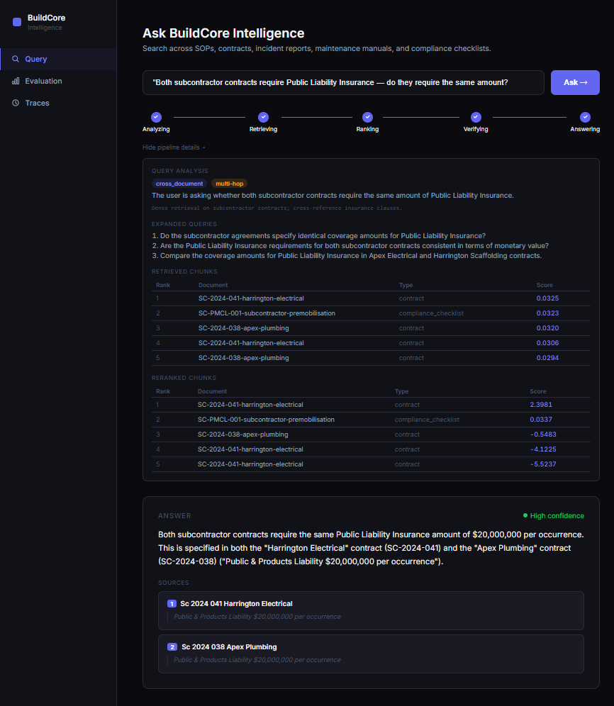
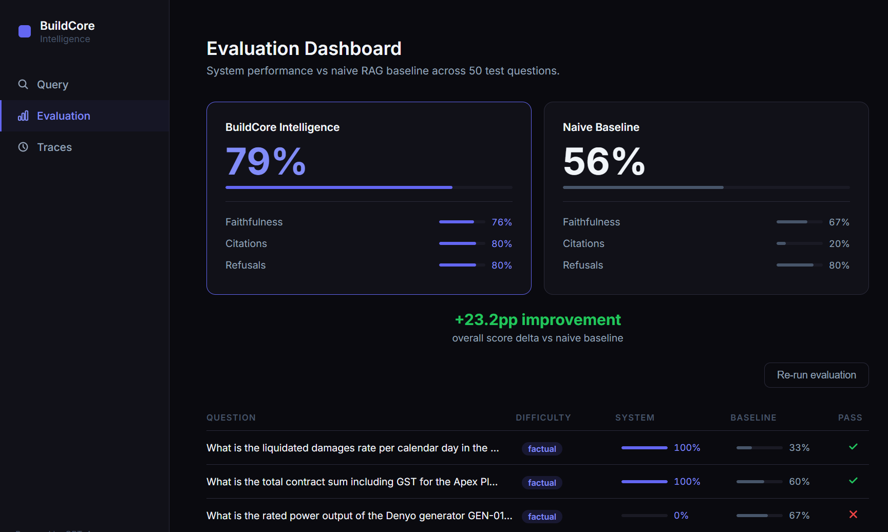

# BuildCore Intelligence

An enterprise-grade retrieval-augmented generation system for construction
and facilities management operations. Built to demonstrate what production
RAG looks like beyond the tutorial — multi-layer retrieval architecture,
document-type-aware ingestion, a self-correcting retrieval critic, and a
built-in evaluation framework with measurable before/after results.



---

## The Problem with Naive RAG

The standard RAG implementation — embed a query, retrieve top-k by cosine
similarity, generate an answer — works in demos but breaks in production
for three specific reasons.

**Retrieval is a single undifferentiated step.** A query asking for a
specific contract clause and a query asking how to inspect a harness both
get treated identically. There is no routing, no strategy differentiation,
no awareness that these are fundamentally different retrieval tasks.

**Fixed-size chunking destroys document structure.** Splitting a numbered
safety procedure mid-step, separating a financial table from its headers,
or merging three unrelated email messages into one chunk produces broken
fragments. The retrieval system then operates on semantically corrupted
inputs.

**There is no quality gate before generation.** The model receives whatever
cosine similarity returned and generates an answer — regardless of whether
the evidence is strong or weak. Hallucination is invisible because the
system has no mechanism to say "I don't have enough information to answer
this reliably."

BuildCore Intelligence addresses all three.

---

## Architecture

The pipeline has six layers. Each exists for a specific, defensible reason.

### Layer 1 — Query Analysis

Before touching the vector store, the incoming query is classified using
GPT-4o-mini with structured output. Queries are routed into one of five
types: `factual`, `procedural`, `cross_document`, `ambiguous`, or
`out_of_scope`. The classification drives retrieval strategy — a factual
lookup against contracts uses a different approach than a procedural query
about maintenance steps. Out-of-scope queries are refused before any
retrieval occurs, preventing the generator from hallucinating answers to
questions the corpus cannot support.

### Layer 2 — Query Expansion

The original query is rephrased into three variants targeting different
vocabulary, specificity levels, and phrasing styles. All four queries are
used independently for dense retrieval, with results merged and
deduplicated by chunk ID.

A worker asking "what do I do if there's a gas leak on the forklift" uses
different vocabulary than the maintenance manual's "Apply soapy water to
connections — any bubbling indicates a gas leak." Query expansion bridges
that vocabulary gap without requiring the user to know the exact phrasing
in the source document.

### Layer 3 — Hybrid Retrieval

Two retrievers run in parallel:

**Dense retriever** — embeds all four query variants using
`text-embedding-3-small`, queries ChromaDB for nearest neighbours per
variant, merges results keeping the best cosine similarity score per chunk.

**Sparse retriever** — BM25 keyword search via `rank_bm25` over the same
corpus. Effective for exact matches that semantic search misses: document
IDs, form numbers, clause references, and specific technical identifiers.

Results are combined using **Reciprocal Rank Fusion** (RRF, k=60), which
rewards chunks that rank highly in both lists without requiring score
normalisation between the two systems.

Both retrievers search small **child** chunks and return their full **parent**
chunks — see [Small-to-Big Retrieval](#small-to-big-retrieval-search-small-answer-big)
below. The whole layer sits behind a swappable adapter so it can be replaced
by Azure AI Search in production without touching any other layer.

### Layer 4 — Cross-Encoder Reranking

The merged hybrid results are reranked using
`cross-encoder/ms-marco-MiniLM-L-6-v2`. A cross-encoder sees the query
and each candidate chunk together and scores them jointly — significantly
more accurate than bi-encoder cosine similarity for final-stage ranking.
The cost is acceptable when operating on 20–40 candidates rather than the
full corpus.

### Layer 5 — Retrieval Critic

Before any generation occurs, an LLM-as-judge step evaluates whether the
reranked chunks are actually sufficient to answer the query. If the verdict
is insufficient, the critic generates a refined query and triggers a second
full retrieval pass. The generator only runs after the critic is satisfied.

This is the quality gate that prevents hallucination. The system will
refuse to answer rather than generate a plausible-sounding response from
weak evidence. In construction and facilities management — where an
incorrect answer about a safety procedure or contract clause has real
consequences — this is not optional.

### Layer 6 — Grounded Generation with Citations

GPT-4o generates the final answer under strict instructions: use only the
provided chunks, cite every factual claim by document ID, and return a
structured response with inline citations and verbatim excerpts. Every
answer is fully traceable to its source document and section.

---

## Document-Type-Aware Ingestion

The corpus contains six document types, each requiring a different
chunking strategy. Fixed-size naive chunking fails all of them.

| Document Type | Chunking Strategy | Key Challenge Solved |
|---|---|---|
| Safety SOPs | Section-aware, split on `━` separators | Subsections stay with parent section headers |
| Contracts | Schedule-level chunks, clause subdivision | Financial tables never split across chunks |
| Incident Emails | One chunk per message, full header preserved | Sender, date, subject co-embedded with body |
| Maintenance Manuals | Section-level, step sequences preserved | `STEP N` and sub-steps always stay together |
| Compliance Checklists | Section-level, tabular rows intact | Item codes stay with their descriptions |
| OSHA Regulatory PDFs | Section/heading-aware over extracted PDF text | Regulatory clauses stay whole across page breaks |

Each document is classified on ingestion and routed to the appropriate
chunker. Chunk IDs are deterministic SHA-256 hashes of document ID and
content — re-ingesting an unchanged corpus is fully idempotent.

**This system is deliberately built without LangChain.** Every retrieval
and ingestion layer is a standalone module. Each architectural decision is
visible, explainable, and debuggable — without the abstraction overhead
that makes LangChain-based systems difficult to diagnose in production.

---

## Small-to-Big Retrieval: Search Small, Answer Big

This is the most consequential change to the retrieval architecture, and it
solves a problem that sits at the heart of every RAG system.

### The tension

Chunk size forces an uncomfortable trade-off, and you cannot win both sides
of it with a single chunk size.

**Big chunks answer well but search badly.** A full safety SOP section
contains everything needed to answer a question properly. But when you turn
2,000 characters into a single embedding — one list of numbers meant to
capture the "meaning" of the whole thing — the specific sentence you care
about gets averaged in with everything around it. Ask about a gas leak, and
the one sentence about gas leaks is diluted by fifteen sentences about
tyre pressure and battery terminals. The match is weak, so the right chunk
may not even be retrieved.

**Small chunks search well but answer badly.** Embed two sentences and the
match is sharp, because the embedding is *about* that one thing. But hand
those two sentences to the generator and it has no surrounding context — no
section header, no preceding steps, no safety warning that came three
sentences earlier. It answers, but thinly, and sometimes wrongly.

### The resolution

Do both. Index at two sizes and use each for what it is good at.

Every document is still chunked by the structure-aware chunkers into
**parent** chunks — a full SOP section, a whole contract clause, one email
message. Each parent is then split into **child** chunks of 2–3 sentences.

Only the children get embedded and BM25-indexed. Search runs against the
children, so matching is precise. But every child carries a pointer back to
its parent, and the moment a child matches, the retriever swaps it for the
parent before anything else in the pipeline sees it. The reranker and the
generator only ever work with full-context parents.

> **The analogy:** it is the difference between a book's index and its
> chapters. You search the index because it is specific — one line per
> concept, nothing diluting it. But you don't *read* the index entry. It
> gives you a page number, and you go read the whole page. Children are the
> index. Parents are the page.

### What this changes in practice

| | Before | After |
|---|---|---|
| What gets embedded | Whole parent chunk (up to ~2,000 chars) | Child chunk (2–3 sentences) |
| What the generator reads | The same chunk that matched | The full parent of whatever matched |
| Precision of matching | Diluted — one relevant sentence averaged with many irrelevant ones | Sharp — the embedding is about one topic |
| Context at generation | Whatever the chunk happened to contain | Always the complete structural unit |
| Long source text | **Silently truncated at 6,000 chars** | Never truncated — nothing is dropped |

Three effects are worth calling out specifically.

**Retrieval got more precise without the answers getting thinner.** This is
the whole point. Normally, improving match precision by shrinking chunks
costs you answer quality. Here it doesn't, because the thing you search and
the thing you read are no longer the same object.

**Silent data loss is gone.** The old pipeline capped text at 6,000
characters before embedding and cut off anything beyond it — quietly, with
only a log line. Any content past that ceiling was simply unsearchable, and
nobody would know. Children are now capped at 1,200 characters *by
construction*, with over-long sentences wrapped at word boundaries rather
than cut. Every character of the corpus is now reachable. The truncation
code, and a fiddly ID-collision workaround it required, were both deleted.

**Retrieval over-fetches to compensate.** Because many children collapse
into one parent, fetching 20 children might yield only 6 distinct parents.
The retrievers now fetch `top_k × 4` children (tunable via
`CHILD_FETCH_MULTIPLIER`) so that enough distinct parents survive the
collapse. This is the one real cost of the design: slightly more work per
query, in exchange for precision that doesn't sacrifice context.

Everything is tunable without touching code — `CHILD_SENTENCES`,
`CHILD_OVERLAP`, `CHILD_MAX_CHARS`, and `CHILD_FETCH_MULTIPLIER` in `.env`.
Children overlap by one sentence by default, so a fact spanning a window
boundary is still fully present in at least one child.

> **Note on measurement:** the evaluation numbers reported below were
> produced *before* the small-to-big migration. The rationale above is
> architectural, not yet measured. Re-running the eval suite against the
> re-ingested index is the honest next step, and the harness exists to do
> exactly that.

---

## The Retriever Adapter: Built to Move to Azure

The local stack — ChromaDB, BM25, and RRF fusion — is a genuine hybrid
retrieval implementation, and it is what runs when you clone this repo. But
the production target is **Azure AI Search**, whose managed hybrid search and
semantic ranker replace most of that machinery.

Rather than let that become a rewrite, retrieval sits behind a single
interface (`retrieval/base.py`), and the backend is chosen at runtime by one
environment variable:

```bash
RETRIEVER_BACKEND=local            # ChromaDB + BM25 + RRF (default)
RETRIEVER_BACKEND=azure_ai_search  # Azure AI Search hybrid + semantic ranker
```

Everything upstream and downstream — query analysis, expansion, reranking,
the critic, generation — is unchanged by that switch. Both `query.py` and
`evaluator.py` resolve their retriever through `get_retriever()`, which
matters more than it looks: **the evaluation harness always scores the
backend that actually ships.** Swap to Azure and the eval numbers describe
Azure, with no code changes and no second measurement path to keep in sync.

The parent-child design carries across the boundary by design. Azure AI
Search has a native feature — *index projections* — that expresses exactly
the same idea: child documents carry a parent key and the parent's fields.
The small-to-big model is therefore not local scaffolding to be thrown away;
it is the same architecture spoken in Azure's vocabulary.

The Azure retriever is currently a scaffold, wired up during the deployment
phase (there is no local emulator for Azure AI Search, so it is built against
the real service). The MiniLM cross-encoder reranker stays as-is locally; in
production, Azure's managed semantic ranker fills that role.

---

## Corpus

The corpus contains 17 documents across six types. Ingestion produces
structure-aware **parent** chunks, then splits each into small 2-3 sentence
**child** chunks (small-to-big retrieval): children are embedded and indexed
for precise matching, while the parent is returned for full-context
generation.

Twelve documents are the fictional BuildCore Operations corpus; five are real
OSHA regulatory publications. That pairing is the point, and it is deliberate
rather than incidental: the OSHA documents cover the *same topics* as
BuildCore's internal SOPs. OSHA 3150 is a scaffold-use guide and BuildCore has
a scaffold SOP; OSHA 3146 covers fall protection in construction and BuildCore
has a fall-protection SOP.

That mirrors how enterprise knowledge bases actually look — company policy
sitting next to the external regulation it implements — and it enables the
queries that matter most: *"what does our scaffold SOP require, and does it
meet OSHA?"* is a cross-document question spanning an internal procedure and a
73-page federal guide.

**Safety SOPs (3)** — Fall Protection (SOP-001), Scaffold Safety (SOP-005),
Hazard Communication (SOP-007)

**Subcontractor Contracts (2)** — Harrington Electrical Services
(SC-2024-041, $366k scope), Apex Plumbing & Drainage (SC-2024-038, $191k
scope)

**Incident Emails (3)** — Forklift near-miss with investigation and
corrective actions (INC-2024-007), Laceration LTI (INC-2024-002), Epoxy
chemical spill (INC-2024-009)

**Maintenance Manuals (2)** — Toyota 8FGF25 forklift (MAINT-FLT-03),
Denyo DCA-45SPK3 generator (MAINT-GEN-01)

**Compliance Checklists (2)** — Daily site safety inspection (SSIC-001),
Subcontractor pre-mobilisation checklist (SC-PMCL-001)

**OSHA Regulatory Documents (5)** — real published PDFs: *A Guide to Scaffold
Use in the Construction Industry* (OSHA 3150, 73pp), *Job Hazard Analysis*
(OSHA 3071, 51pp), *Fall Protection in Construction* (OSHA 3146, 48pp),
*Materials Handling and Storage* (OSHA 2236, 41pp), and the Walking-Working
Surfaces & Fall Protection final-rule fact sheet (OSHA 3903, 3pp)

The document mix is intentionally heterogeneous — six structurally different
document types, mixed formatting, tables, email threads, numbered procedures,
and real-world PDFs — to stress-test every layer of the ingestion and
retrieval pipeline.

### A note on scale, and why it makes retrieval hard

The five OSHA PDFs dominate the index by volume: they produce **4,093 of the
~4,900 child chunks**, roughly 84% of the corpus, because a published
regulatory PDF is far longer than a two-page internal SOP. OSHA 3150 alone is
2,152 children — more than every BuildCore document combined.

The topical pairing that makes the corpus realistic is exactly what makes it
adversarial. BuildCore's scaffold SOP produces ~70 child chunks; OSHA's
scaffold guide produces ~2,152. A query about scaffolding therefore faces a
**30:1 imbalance of on-topic competitors**, and pure vector similarity has no
principled reason to prefer the company's own procedure over the federal guide
— both are genuinely about scaffolding.

This is where the upstream layers stop being decoration. Query classification
and the `document_type` filter exist to decide *which* kind of document a
question wants; the retrieval critic exists to notice when the answer came from
the wrong one. A corpus of twelve tidy, same-sized, topically-disjoint
documents would never have exercised either.

---

## Evaluation Results

The system was evaluated against a hand-crafted test suite of 50 questions
across four difficulty levels: simple factual (15), procedural (15),
multi-hop cross-document reasoning (10), and out-of-scope refusals (10).

Each answer was scored by an LLM judge on three metrics: faithfulness to
source documents, citation presence, and refusal accuracy.

| Metric | BuildCore Intelligence | Naive Baseline | Delta |
|---|---|---|---|
| Faithfulness | 76.4% | 66.8% | +9.6pp |
| Citation presence | **80.0%** | **20.0%** | **+60.0pp** |
| Refusal accuracy | 80.0% | 80.0% | 0.0pp |
| **Overall** | **78.8%** | **55.6%** | **+23.2pp** |



The citation presence result is the most significant finding. The naive
baseline generates answers without citing sources 80% of the time. The
full pipeline cites sources on 80% of answers — a 4x improvement. For
enterprise deployments where auditability matters, this is the difference
between a system that can be trusted and one that cannot.

The naive baseline used for comparison: dense-only retrieval, no query
expansion, no reranking, no retrieval critic, plain GPT-4o generation with
no structured output or citation requirements.

---

## Tech Stack

| Layer | Technology |
|---|---|
| Backend | Python 3.11, FastAPI, uvicorn |
| Frontend | React 18, Vite |
| Vector store | ChromaDB (cosine similarity, persistent) |
| Embeddings | OpenAI `text-embedding-3-small` |
| Query analysis, expansion, critic | GPT-4o-mini (structured output) |
| Final generation | GPT-4o |
| Sparse retrieval | BM25 via `rank_bm25` |
| Reranker | `cross-encoder/ms-marco-MiniLM-L-6-v2` |
| Rank fusion | Reciprocal Rank Fusion (RRF, k=60) |
| Chunking model | Small-to-big parent-child (structure-aware parents, 2–3 sentence children) |
| Retrieval backend | Swappable adapter — local (ChromaDB + BM25) or Azure AI Search |
| Containerisation | Docker Compose |

---

## Running Locally

**Prerequisites:** Docker Desktop, OpenAI API key

```bash
# 1. Clone and configure
git clone https://github.com/wasifrepo/buildcore-rag.git
cd buildcore-rag
cp .env.example .env
# Edit .env and add your OPENAI_API_KEY

# 2. Start the system
docker-compose up --build

# 3. Run ingestion (first time only — builds the ChromaDB index)
docker exec buildcore-backend python -c \
  "from ingestion.pipeline import run_ingestion; \
   run_ingestion(data_dir='/app/data/raw')"

# 4. Open the UI
# http://localhost:5173
```

The ingestion step chunks all 12 documents into structure-aware parents,
splits those into small child chunks, embeds the children, and upserts them
into ChromaDB. It runs once — the index persists across container restarts.
Re-run only when documents change (reset the collection first if the chunking
strategy changed, so stale chunks from a previous scheme aren't left behind).

---

## Project Structure

```
buildcore-rag/
├── backend/
│   ├── api/
│   │   └── routes/          # FastAPI SSE endpoints (query, evaluate, traces)
│   ├── ingestion/
│   │   ├── classifier.py     # Document type detection
│   │   ├── pipeline.py       # Ingestion orchestrator with PDF support
│   │   ├── child_splitter.py # Parent → child splitting (small-to-big)
│   │   └── chunkers/         # Five type-specific chunkers + base class
│   ├── retrieval/
│   │   ├── base.py                     # Retriever interface (local ↔ Azure)
│   │   ├── factory.py                  # Backend selection via RETRIEVER_BACKEND
│   │   ├── local_retriever.py          # ChromaDB + BM25 + RRF
│   │   ├── azure_ai_search_retriever.py # Azure AI Search (production backend)
│   │   ├── _parenting.py               # Child → parent collapsing
│   │   ├── query_analyzer.py           # Intent classification and routing
│   │   ├── query_expander.py           # Multi-query generation
│   │   ├── dense_retriever.py          # ChromaDB semantic search
│   │   ├── sparse_retriever.py         # BM25 keyword search
│   │   ├── hybrid_retriever.py         # RRF rank fusion
│   │   ├── reranker.py                 # Cross-encoder reranking
│   │   └── retrieval_critic.py         # LLM-as-judge sufficiency check
│   ├── generation/
│   │   ├── generator.py     # Grounded generation with citations
│   │   └── schemas.py       # Pydantic models for entire pipeline
│   └── evaluation/
│       ├── test_suite.json  # 50 hand-crafted Q&A pairs
│       ├── baseline.py      # Naive RAG comparison system
│       ├── metrics.py       # LLM-judge scoring functions
│       └── evaluator.py     # Full evaluation orchestrator
├── frontend/
│   └── src/
│       ├── pages/           # Query, Evaluation, Traces
│       ├── components/      # Reusable UI components
│       ├── hooks/           # useSSE, useEvaluation, useTraces
│       └── utils/           # API client, formatters
└── data/
    └── raw/                 # BuildCore corpus (5 document type folders)
```

---

## Key Design Decisions

**No LangChain.** LangChain abstracts away exactly the layers this system
is designed to make visible. Building without it means every decision is
explicit, every failure is traceable, and every component is replaceable
without framework constraints.

**Retrieval critic before generation.** Most RAG systems pass whatever
retrieval returns directly to the generator. This system inserts a
judgement step. The cost is one additional LLM call per query. The benefit
is a system that knows when it doesn't know enough — and says so instead
of hallucinating.

**Document-type-aware chunking over fixed-size splitting.** The ingestion
pipeline classifies each document before chunking. A safety SOP with
nested numbered sections is chunked differently from a contract with
financial tables, which is chunked differently from a multi-message email
thread. The retrieval quality difference is significant and measurable.

**Search small, answer big.** Chunk size is a trade-off between precise
matching and sufficient context, and picking one size means losing one of
them. Indexing children and returning parents refuses the trade-off instead
of splitting the difference.

**An adapter, not a rewrite, for Azure.** The local retrieval stack is real
and fully working, but it is not the production target. Putting retrieval
behind an interface from the start means the Azure migration is a
configuration change rather than a fork — and the evaluation harness follows
the switch automatically.

**Evaluation as a first-class component.** The test suite was written
before the evaluator, and the evaluator scores both the full pipeline and
a naive baseline. The +23.2pp overall improvement and the 4x citation
presence improvement are not estimated — they are measured against 50
hand-crafted test cases with an LLM judge.
